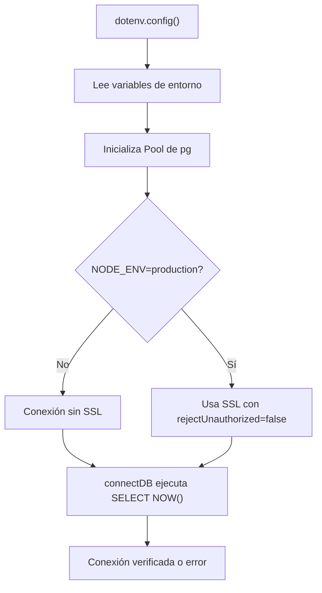

# Módulo: db.js

## Introducción

El módulo `db.js` configura una conexión **directa a PostgreSQL** utilizando el paquete `pg`.  
Se usa principalmente para operaciones fuera del ORM Prisma, como scripts, validaciones o pruebas de conexión.

## Descripción general

- Carga las variables de entorno mediante `dotenv`.  
- Inicializa un `Pool` de conexiones con los parámetros del `.env`.  
- Ofrece una función `connectDB()` para probar conectividad.  
- Exporta:
  - `pool` → instancia reutilizable de conexión a PostgreSQL.
  - `connectDB()` → verificación inicial o manual de conexión.

## Diagrama de flujo (Mermaid)



## Ejemplo de uso

```js
import { connectDB } from "#config/db.js";

await connectDB();
```

Salida esperada:

```bash
✅ Conexión exitosa a PostgreSQL
Hora actual en PostgreSQL: 2025-10-31 18:21:00.123456+00
```

## Variables de entorno utilizadas

| Variable   | Descripción                  | Ejemplo                      |
| ---------- | ---------------------------- | ---------------------------- |
| `DB_HOST`  | Host del servidor PostgreSQL | `localhost`                  |
| `DB_PORT`  | Puerto del servidor          | `5432`                       |
| `DB_NAME`  | Nombre de la base de datos   | `study_task_insights`        |
| `DB_USER`  | Usuario de conexión          | `postgres`                   |
| `DB_PASS`  | Contraseña del usuario       | `secret`                     |
| `NODE_ENV` | Determina uso de SSL         | `production` o `development` |

## Dependencias internas

- `pg` — cliente oficial de PostgreSQL.
- `dotenv` — carga de variables de entorno.
