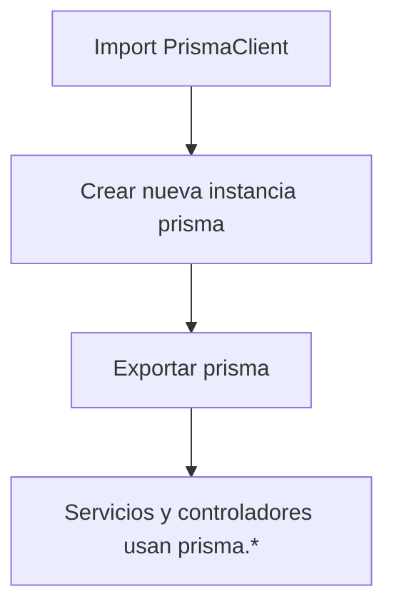

# Módulo: prismaClient.js

## Introducción

El módulo `prismaClient.js` instancia el cliente ORM **Prisma**, encargado de la interacción con la base de datos PostgreSQL de forma tipada y segura.

## Descripción general

- Importa el cliente generado automáticamente desde `#generated/prisma/index.js`.  
- Crea una instancia única de `PrismaClient`.  
- Exporta el objeto `prisma` para ser usado globalmente en servicios y controladores.

## Diagrama de flujo (Mermaid)



## Ejemplo de uso

```js
import prisma from "#config/prismaClient.js";

const terms = await prisma.term.findMany({
  orderBy: { name: "asc" },
});
```

## Ventajas del enfoque

- **Seguridad tipada**: Prisma valida los tipos y nombres de columnas al compilar.
- **Transacciones simples**: permite `prisma.$transaction()` para operaciones compuestas.
- **Compatibilidad** con el esquema definido en `prisma/schema.prisma`.

## Dependencias internas

- `@prisma/client` (importado desde `/generated/prisma/`).

## Convenciones de uso

- Se importa como alias `#config/prismaClient.js`.
- No debe crearse múltiples instancias; se mantiene una única conexión activa para toda la aplicación.
- En el apagado del servidor (`server.js`), siempre debe ejecutarse:

  ```js
  await prisma.$disconnect();
  ```
