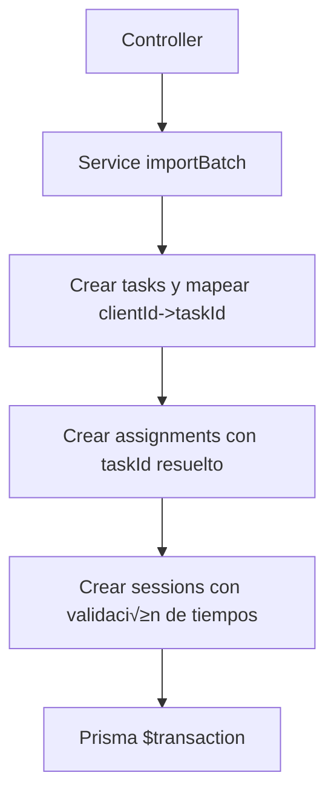

# Service: batchImportService.js

## Introducción

Orquesta la importación por lotes con resolución de referencias `clientId -> taskId` y creación de registros relacionados en una transacción Prisma.

## Descripción general

1. Crea `tasks` y construye `taskIdMap`.
2. Inserta `task_tag_assignments` con el `taskId` resuelto.
3. Inserta `study_sessions` validando tiempos y FK.

## Diagrama de flujo

```mermaid
flowchart TD
  A[Controller] --> B[Service importBatch]
  B --> C[Crear tasks y mapear clientId->taskId]
  C --> D[Crear assignments con taskId resuelto]
  D --> E[Crear sessions con validación de tiempos]
  E --> F[Prisma $transaction]
```

## Función exportada

### üü© `importBatch({ tasks, assignments, sessions })`

- Ejecuta todo en **una sola transacción**.
- Manejo de errores:

  - `400` body vacío / referencias no resueltas.
  - `409` FK (`P2003`) y duplicados (`P2002`).

## Validaciones clave

- Fechas de `study_sessions`: `startedAt` ≤ `endedAt`, formatos válidos.
- Ignora campos de solo lectura en `tasks`/`assignments`/`sessions`.

## Dependencias internas

- `#config/prismaClient.js`
- Prisma ORM (`$transaction`, `create`)
