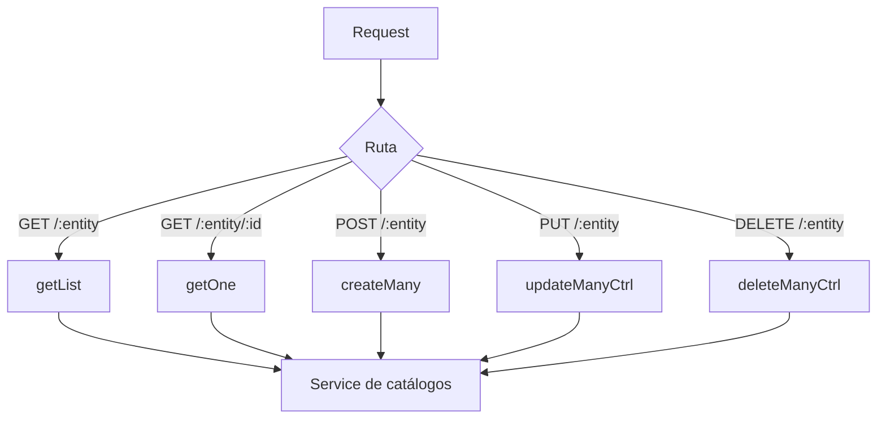

# Controller: catalogsController.js

## Introducción

Controlador HTTP para catálogos (`terms`, `task-statuses`, `task-priorities`, `task-types`, `task-tags`). Orquesta validaciones mínimas de request y delega la lógica de datos al servicio. :contentReference[oaicite:0]{index=0}

## Funciones expuestas

- `getList(req, res, next)` → lista con búsqueda (`q`) y paginación (`limit`, `offset`). Pasa parámetros al servicio y responde JSON. :contentReference[oaicite:1]{index=1}  
- `getOne(req, res, next)` → obtiene un registro por `:id` y `:entity`. 404 si no existe (propagado por el service). :contentReference[oaicite:2]{index=2}  
- `createMany(req, res, next)` → crea 1..n registros; valida body no vacío; responde `201`. :contentReference[oaicite:3]{index=3}  
- `updateManyCtrl(req, res, next)` → actualiza 1..n registros; valida body no vacío; errores de contrato/únicos desde el service. :contentReference[oaicite:4]{index=4}  
- `deleteManyCtrl(req, res, next)` → elimina 1..n por `body.ids`; **rechaza** `?ids=` en query con `400`. :contentReference[oaicite:5]{index=5}

## Diagrama de flujo



## Validaciones clave

- Body requerido en `POST`/`PUT`; si vacío → `400 "Body vacío"`.
- `DELETE` solo acepta `{"ids":[...]}` en body; si llega `?ids=` → `400`.
- Conversión segura de `limit`/`offset` a `Number` antes de delegar.

## Formatos de respuesta

- Éxito: `res.json(...)` (o `res.status(201).json(...)` en creación).
- Error: pasa a `next(err)` para manejo centralizado por `errorHandler`.

## Ejemplos

### Crear varios

```json
POST /api/catalogs/task-types
[
  {"code":"exam","description":"Examen"},
  {"code":"project","description":"Proyecto"}
]
```

**201 Created** → `{ "count": 2, "items": [...] }` (estructura definida por el service).

### Eliminar por IDs

```json
DELETE /api/catalogs/task-tags
{ "ids": ["uuid-1","uuid-2"] }
```

**200 OK** → `{ "count": n, "deletedIds": [...], "notFoundIds": [...], "blockedIds": [...] }` (desde el service).

## Dependencias

- `#services/catalogsService.js` para toda la interacción con Prisma.
