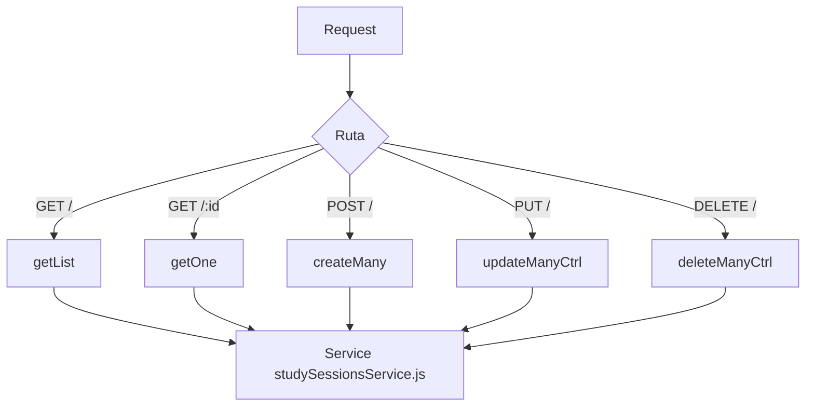

# Controller: studySessionsController.js

## Introducción

Controlador HTTP para la entidad **`study_sessions`**, encargada de registrar las **sesiones de estudio** asociadas a cada tarea.  
Permite gestionar el tiempo invertido en tareas, mantener integridad temporal (`startedAt <= endedAt`) y consultar métricas históricas de desempeño académico.  
Orquesta las validaciones mínimas de request y delega la lógica de datos al servicio `studySessionsService.js`.

## Funciones expuestas

- `getList(req, res, next)` → lista sesiones con filtros (`taskId`, `startedFrom`, `endedTo`, `q` en notas), paginación y orden temporal.
- `getOne(req, res, next)` → obtiene una sesión por `:id` con posibilidad de incluir su tarea relacionada.
- `createMany(req, res, next)` → crea 1..n sesiones, validando que `startedAt` y `endedAt` sean válidas.
- `updateManyCtrl(req, res, next)` → actualiza 1..n sesiones, asegurando coherencia de tiempos (`startedAt ≤ endedAt`).
- `deleteManyCtrl(req, res, next)` → elimina una o varias sesiones, recibiendo `{ "ids": [...] }` en el body.  
  **Rechaza** `?ids=` en query (HTTP 400).

## Diagrama de flujo



## Validaciones clave

- `POST` / `PUT`: body obligatorio; si vacío → `400`.
- `POST`: requiere `startedAt` y `endedAt` válidos (`Date` y `endedAt ≥ startedAt`).
- `DELETE`: solo acepta `{"ids":[...]}` en body; si llega `?ids=` → `400`.

## Formatos de respuesta

- Éxito: `res.json(...)` (o `res.status(201).json(...)` en creación).
- Error: `next(err)` delega al `errorHandler` global.

## Ejemplos

### Crear sesiones de estudio

```json
POST /api/study-sessions
[
  {
    "taskId": "f4235e9a-f574-47ae-a102-5bd3c1106772",
    "startedAt": "2025-11-01T14:00:00.000Z",
    "endedAt": "2025-11-01T15:00:00.000Z",
    "notes": "Lectura del capítulo 3"
  }
]
```

**Respuesta:** 201 Created

```json
{
  "count": 1,
  "items": [
    {
      "studySessionId": "uuid",
      "taskId": "...",
      "durationMinutes": 60,
      "createdAt": "2025-11-01T15:00:01.000Z"
    }
  ]
}
```

### Eliminar sesiones

```json
DELETE /api/study-sessions
{ "ids": ["uuid-1", "uuid-2"] }
```

**Respuesta:** 200 OK

```json
{
  "count": 2,
  "deletedIds": ["uuid-1", "uuid-2"],
  "notFoundIds": []
}
```

## Dependencias

- `#services/studySessionsService.js`
- `#config/prismaClient.js`
