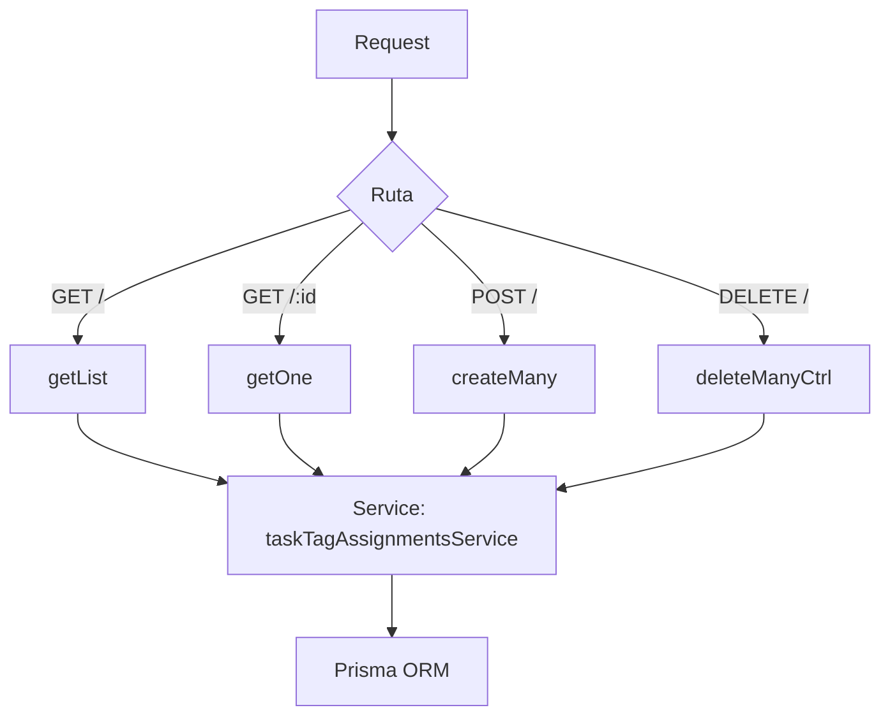

# Controller: taskTagAssignmentsController.js

## Introducción

Controlador HTTP para la entidad relacional **`task_tag_assignments`**, encargada de vincular **tareas (`tasks`)** con **etiquetas (`task_tags`)**.  
Gestiona las operaciones CRUD básicas, validando los cuerpos de las solicitudes y delegando la lógica de acceso a datos al servicio correspondiente.

## Funciones expuestas

- `getList(req, res, next)` → lista las asignaciones con filtros por `taskId`, `tagId`, paginación (`limit`, `offset`) y relaciones opcionales (`include=task|tag|all`).
- `getOne(req, res, next)` → obtiene una asignación específica por `:id`, con soporte para `include`.
- `createMany(req, res, next)` → crea una o varias relaciones tarea–etiqueta; valida body no vacío; responde `201`.
- `deleteManyCtrl(req, res, next)` → elimina una o varias asignaciones mediante `body.ids`; **rechaza** el uso de `?ids=` en query (`400`).

## Validaciones clave

- `POST`: body obligatorio (objeto o arreglo); si vacío → `400 "Body vacío"`.
- `DELETE`: solo permite `{ "ids": [...] }` en body; si llega `?ids=` → `400`.
- `GET /:id`: lanza `404` si la asignación no existe.

## Errores gestionados

- `409`:  
  - **P2002** → Duplicado (`taskId + taskTagId` ya existe).  
  - **P2003** → Violación de FK (tarea o etiqueta no existen).  
- `404`: No encontrado.  
- `400`: Body inválido.

## Formato de respuesta

### Ejemplo: Crear varias asignaciones

```json
POST /api/task-tag-assignments
[
  { "taskId": "uuid-task1", "taskTagId": "uuid-tagA" },
  { "taskId": "uuid-task1", "taskTagId": "uuid-tagB" }
]
```

**Respuesta:** 201 Created

```json
{
  "count": 2,
  "items": [
    { "taskTagAssignmentId": "uuid1", "taskId": "uuid-task1", "taskTagId": "uuid-tagA" },
    { "taskTagAssignmentId": "uuid2", "taskId": "uuid-task1", "taskTagId": "uuid-tagB" }
  ]
}
```

## Diagrama de flujo



## Dependencias

- `#services/taskTagAssignmentsService.js`
- `#config/prismaClient.js`
