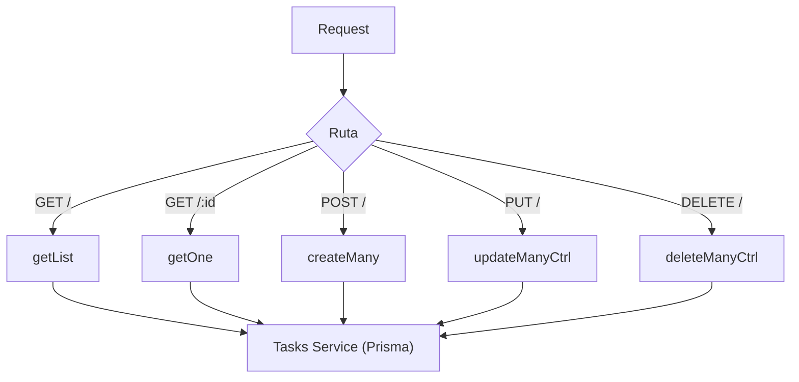

# Controller: tasksController.js

## Introducción

Controlador HTTP para la entidad **tasks**. Expone endpoints de listado, detalle, creación masiva, actualización masiva y eliminación masiva. Orquesta validaciones mínimas de request y delega la lógica de datos al servicio.

## Endpoints manejados

| Método | Ruta              | Función            | Descripción |
|-------:|-------------------|--------------------|-------------|
| GET    | /api/tasks        | `getList`          | Lista tareas con filtros, paginación y `include`. |
| GET    | /api/tasks/:id    | `getOne`           | Obtiene una tarea por `taskId`. |
| POST   | /api/tasks        | `createMany`       | Crea 1..n tareas (objeto o arreglo). |
| PUT    | /api/tasks        | `updateManyCtrl`   | Actualiza 1..n tareas (cada objeto debe incluir `taskId`). |
| DELETE | /api/tasks        | `deleteManyCtrl`   | Elimina 1..n por `body.ids`. |

## Query params soportados (GET /api/tasks)

- **Filtros:**  
  `q`, `statusId`, `priorityId`, `typeId`, `termId`, `tagId`, `dueFrom`, `dueTo`, `archived` (`true|false`, por defecto solo activas).
- **Proyección:**  
  `include=lookups|tags|all`.
- **Paginación/Orden:**  
  `limit` (1..200), `offset` (>=0), `orderByField`, `orderByDir` (`asc|desc`).

## Validaciones clave

- `POST/PUT`: body no vacío → `400 "Body vacío"`.
- `PUT`: cada objeto debe incluir `taskId` → `400`.
- `DELETE`: requiere `{"ids":[...]}` en body (no `?ids=`) → `400`.

## Manejo de errores (vía service)

- `404`: tarea no encontrada (`getOne`).
- `409`: duplicado (índices únicos parciales) o violación de FK.

## Diagrama

