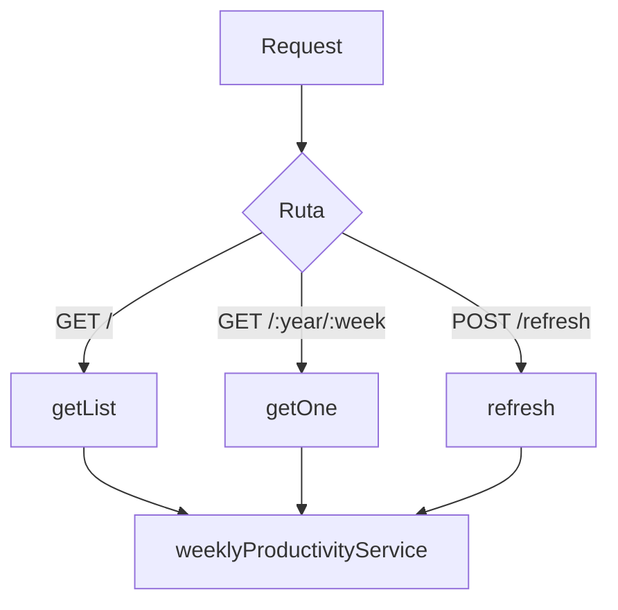

# Controller: weeklyProductivityController.js

## Introducción

Controlador HTTP que expone los endpoints de **productividad semanal**.
Orquesta las peticiones REST y delega toda la lógica a `weeklyProductivityService.js`.

## Funciones expuestas

- `getList(req, res, next)` → Lista la productividad semanal con filtros, paginación y orden.
- `getOne(req, res, next)` → Devuelve un registro puntual por `:year` y `:week`.
- `refresh(_req, res, next)` → Refresca la vista materializada (uso administrativo).

## Diagrama de flujo



## Validaciones clave

- Conversión numérica segura de `req.query` y `req.params`.
- Manejo centralizado de errores mediante `next(err)` (usa `errorHandler`).
- Solo `POST /refresh` puede modificar datos (invoca `REFRESH MATERIALIZED VIEW`).

## Formatos de respuesta

- **Éxito:** `res.json(...)`
- **Error:** `next(err)` → manejado por `errorHandler.js`.

## Ejemplos

### Consultar productividad semanal por año y semana

```bash
GET /api/weekly-productivity/2026/3
```

**200 OK:**

```json
{
  "weekly_productivity_id": "b73faf2b-df91-47e3-b02b-740c308aacc2",
  "iso_year": 2026,
  "iso_week": 3,
  "tasks_created": 2,
  "tasks_completed": 1,
  "completion_rate": 50,
  "planned_minutes": 100,
  "actual_minutes": 90,
  "avg_completion_time_min": 65,
  "created_at": "2025-11-01T22:21:20.205Z",
  "updated_at": "2025-11-01T22:21:20.205Z"
}
```

## Dependencias

- `#services/weeklyProductivityService.js`
- `express`
