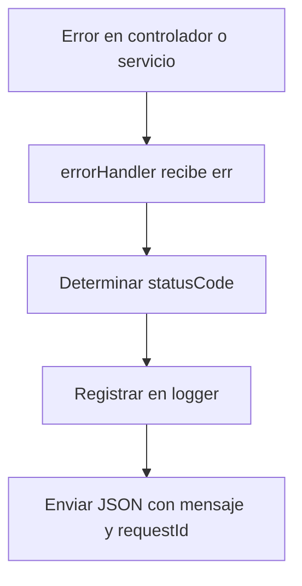

# Middleware: errorHandler

## Introducción

El middleware `errorHandler` gestiona los errores globales del backend.  
Centraliza la captura, registro y respuesta JSON para todos los errores no controlados.

## Descripción general

- Registra errores con `logger.error()` incluyendo `requestId`.
- Envía respuesta JSON estandarizada:

  ```json
  {
    "error": true,
    "message": "Descripción del error",
    "requestId": "uuid"
  }
  ```

- Si el error tiene `statusCode`, usa ese valor. De lo contrario, responde `500`.

## Diagrama de flujo (Mermaid)



## Ejemplo de uso

```js
import { errorHandler } from "#middlewares/errorHandler.js";
app.use(errorHandler);
```

## Campos registrados en logs

| Campo          | Descripción                                                    |
| -------------- | -------------------------------------------------------------- |
| `requestId`    | Identificador único de la petición                             |
| `status`       | Código HTTP resultante                                         |
| `errorName`    | Tipo de error (`Error`, `PrismaClientKnownRequestError`, etc.) |
| `errorMessage` | Mensaje principal                                              |
| `stack`        | Trazado de pila                                                |
| `details`      | Información adicional si existe                                |

## Dependencias internas

- `logger` de `middlewares/logger.js`
