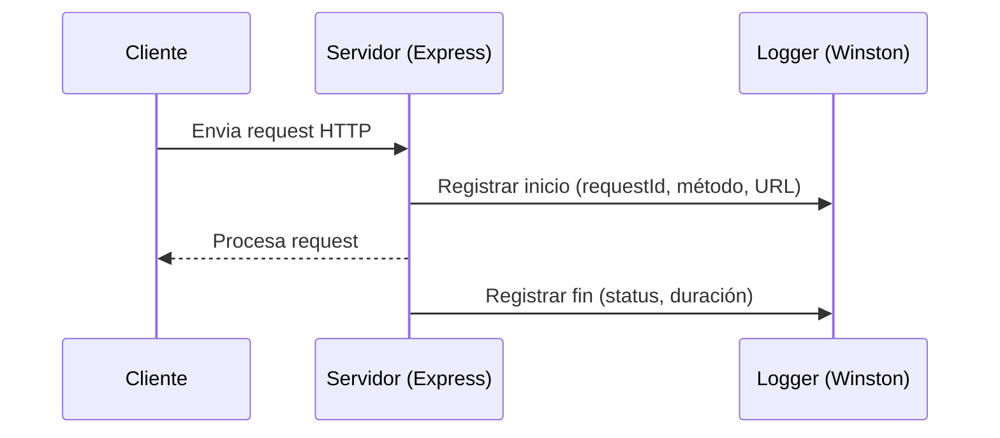

# Middleware: logger

## Introducción

El middleware `logger` usa **Winston** para registrar eventos de aplicación y de cada request HTTP.  
Agrega un identificador único `requestId` a cada petición para trazabilidad.

## Descripción general

- Genera logs estructurados en formato JSON con timestamp.  
- Cada request registra inicio y fin con duración en milisegundos.  
- Exporta dos elementos:
  - `logger`: instancia de Winston configurada.
  - `requestLogger`: middleware Express para seguimiento de peticiones.

## Diagrama de flujo (Mermaid)



## Ejemplo de uso

```js
import { requestLogger } from "#middlewares/logger.js";
app.use(requestLogger);
```

## Estructura de log generada

```json
{
  "level": "info",
  "timestamp": "2025-10-31T17:21:43.000Z",
  "msg": "HTTP request end",
  "requestId": "c95d4b8a-8e63-4a82-b95b-4d81dbe0eec7",
  "method": "GET",
  "url": "/api/catalogs/terms",
  "statusCode": 200,
  "durationMs": 37
}
```

## Dependencias internas

- `winston`
- `uuid` (para generar `requestId`)
