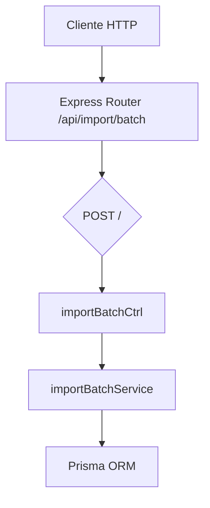

# Rutas: Importación por lotes (`batchImportRoutes.js`)

## Introducción

Define el endpoint para importar datos en lote usando referencias de cliente (`clientId`) que el servidor resuelve a UUIDs reales.

## Descripción general

Permite crear `tasks`, `task_tag_assignments` y `study_sessions` de forma atómica en una sola transacción, resolviendo dependencias por un mapa `clientId -> taskId`.

## Diagrama de flujo



## Endpoints definidos

| Método | Ruta              | Descripción                                     | Controlador     |
| ------ | ----------------- | ----------------------------------------------- | --------------- |
| POST   | /api/import/batch | Importa lotes de tasks, assignments y sessions. | importBatchCtrl |

## Ejemplo de uso

```json
{
  "tasks": [
    {
      "clientId": "t1",
      "termId": 1,
      "title": "Examen Matemática Final",
      "description": "Unidad 6–8. Repasar demostraciones.",
      "taskStatusId": 2,
      "taskPriorityId": 4,
      "taskTypeId": 2,
      "dueAt": "2025-06-10T14:00:00Z",
      "estimatedMin": 180
    },
    {
      "clientId": "t2",
      "termId": 1,
      "title": "Lectura Álgebra Cap 5",
      "description": "Sección de espacios vectoriales.",
      "taskStatusId": 3,
      "taskPriorityId": 2,
      "taskTypeId": 4,
      "dueAt": "2025-05-20T23:59:00Z",
      "estimatedMin": 90,
      "completedAt": "2025-05-18T16:00:00Z"
    }
  ],
  "assignments": [
    { "taskRef": "t1", "taskTagId": "UUID-TAG-EXISTENTE" },
    { "taskRef": "t2", "taskTagId": "UUID-TAG-EXISTENTE" }
  ],
  "sessions": [
    {
      "taskRef": "t1",
      "startedAt": "2025-06-05T14:00:00Z",
      "endedAt": "2025-06-05T16:00:00Z",
      "notes": "Banco de preguntas"
    },
    {
      "taskRef": "t1",
      "startedAt": "2025-06-08T18:30:00Z",
      "endedAt": "2025-06-08T19:50:00Z",
      "notes": "Simulacro (80 min)"
    },
    {
      "taskRef": "t2",
      "startedAt": "2025-05-17T20:00:00Z",
      "endedAt": "2025-05-17T21:30:00Z",
      "notes": "Lectura previa al resumen"
    }
  ]
}
```

## Reglas y convenciones

- `tasks[].clientId` es opcional pero recomendado para referenciar en `assignments`/`sessions`.
- El servidor genera los `taskId` (PK) y retorna `taskIdMap` para que el cliente reemplace.
- Transacción atómica; errores de FK/duplicados retornan `409` con detalles.

## Dependencias internas

- `express.Router`
- `batchImportController.js`
- `batchImportService.js`
