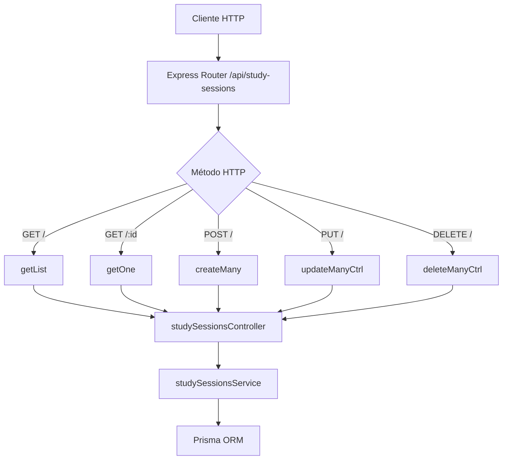

# Rutas: Study Sessions (`studySessionsRoutes.js`)

## Introducción

El módulo `studySessionsRoutes.js` define los endpoints REST para manejar las **sesiones de estudio** vinculadas a tareas.  
Cada ruta se registra bajo `/api/study-sessions` y delega su ejecución a `studySessionsController.js`.

## Descripción general

Las sesiones de estudio son registros cronológicos que permiten medir tiempo real de dedicación a tareas y generar métricas semanales o históricas.  
Cada sesión está asociada a una tarea específica (`taskId`).

## Diagrama de flujo



## Endpoints definidos

| Método   | Ruta                      | Descripción                                 | Controlador      |
| -------- | ------------------------- | ------------------------------------------- | ---------------- |
| `GET`    | `/api/study-sessions`     | Lista sesiones filtradas y paginadas.       | `getList`        |
| `GET`    | `/api/study-sessions/:id` | Obtiene una sesión específica por ID.       | `getOne`         |
| `POST`   | `/api/study-sessions`     | Crea una o varias sesiones nuevas.          | `createMany`     |
| `PUT`    | `/api/study-sessions`     | Actualiza una o varias sesiones existentes. | `updateManyCtrl` |
| `DELETE` | `/api/study-sessions`     | Elimina varias sesiones según `body.ids`.   | `deleteManyCtrl` |

## Parámetros admitidos (GET)

- **Filtros:** `taskId`, `startedFrom`, `startedTo`, `endedFrom`, `endedTo`, `q` (en notas).
- **Include:** `include=task|all` (para traer la tarea asociada).
- **Orden:** `orderByField`, `orderByDir` (`asc|desc`), por defecto `startedAt ASC`.
- **Paginación:** `limit` (máx. 200), `offset` (≥0).

## Ejemplos de uso

### Listar sesiones recientes de una tarea

```bash
GET /api/study-sessions?taskId=f4235e9a-f574-47ae-a102-5bd3c1106772&limit=5
```

**Respuesta:**

```json
{
  "items": [
    {
      "studySessionId": "uuid",
      "startedAt": "2025-11-01T14:00:00.000Z",
      "endedAt": "2025-11-01T15:00:00.000Z",
      "durationMinutes": 60,
      "notes": "Lectura"
    }
  ],
  "total": 1
}
```

### Crear sesión

```bash
POST /api/study-sessions
[
  {
    "taskId": "uuid-task",
    "startedAt": "2025-11-02T08:00:00.000Z",
    "endedAt": "2025-11-02T09:30:00.000Z"
  }
]
```

**Respuesta:**

```json
{
  "count": 1,
  "items": [{ "durationMinutes": 90 }]
}
```

## Dependencias internas

- `express.Router`
- `studySessionsController.js`
- `studySessionsService.js` (vía los controladores)
