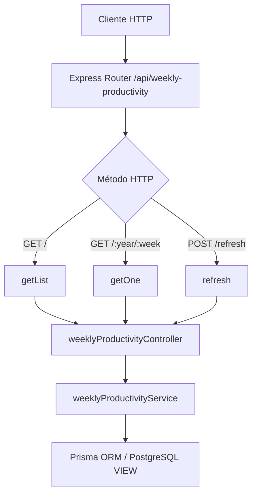

# Rutas: Productividad semanal (`weeklyProductivityRoutes.js`)

## Introducción

El módulo `weeklyProductivityRoutes.js` define los endpoints REST relacionados con la **productividad académica semanal**.
Este módulo permite consultar los datos agregados generados a partir de las tablas `tasks` y `study_sessions`, así como actualizar la vista materializada que los consolida.

## Descripción general

La vista materializada `weekly_productivity` resume las métricas semanales de rendimiento de los estudiantes:

- **Tareas creadas y completadas**
- **Tasa de finalización (`completion_rate`)**
- **Minutos planificados y reales (`planned_minutes`, `actual_minutes`)**
- **Tiempo promedio de completado (`avg_completion_time_min`)**

El módulo expone rutas de **solo lectura** y un endpoint administrativo para refrescar los datos desde la base.

## Diagrama de flujo



## Endpoints definidos

| Método | Ruta                                   | Descripción                                                                           | Controlador |
| ------ | -------------------------------------- | ------------------------------------------------------------------------------------- | ----------- |
| `GET`  | `/api/weekly-productivity`             | Lista los registros de productividad semanal filtrables por año, semana o rango.      | `getList`   |
| `GET`  | `/api/weekly-productivity/:year/:week` | Obtiene un registro específico por año y semana.                                      | `getOne`    |
| `POST` | `/api/weekly-productivity/refresh`     | Refresca la vista materializada `weekly_productivity`. Solo debe usarse por el admin. | `refresh`   |

## Ejemplo de uso (API)

### Listar productividad semanal

```bash
GET /api/weekly-productivity?year=2026
```

**Respuesta:**

```json
{
  "items": [
    {
      "weekly_productivity_id": "b73faf2b-df91-47e3-b02b-740c308aacc2",
      "iso_year": 2026,
      "iso_week": 3,
      "tasks_created": 2,
      "tasks_completed": 1,
      "completion_rate": 50,
      "planned_minutes": 100,
      "actual_minutes": 90,
      "avg_completion_time_min": 65,
      "created_at": "2025-11-01T22:21:20.205Z",
      "updated_at": "2025-11-01T22:21:20.205Z"
    }
  ],
  "total": 1
}
```

### Refrescar la vista materializada

```bash
POST /api/weekly-productivity/refresh
```

**Respuesta:**

```json
{
  "ok": true,
  "refreshed": true,
  "at": "2025-11-01T22:18:00.239Z"
}
```

## Reglas y convenciones

- Todos los endpoints son **solo lectura**, excepto `POST /refresh`.
- `refresh` ejecuta `REFRESH MATERIALIZED VIEW CONCURRENTLY` (con fallback sin `CONCURRENTLY` si no aplica).
- Los filtros soportan: `year`, `week`, `yearFrom`, `yearTo`, `weekFrom`, `weekTo`.
- Los resultados están **paginados** (`limit`, `offset`, máx. 200).
- Ordenamiento seguro por campos listados (`orderByField`, `orderByDir`).
- Los campos numéricos (`tasks_created`, `planned_minutes`, etc.) siempre se devuelven como enteros o flotantes JSON válidos.

## Dependencias internas

- `express.Router`
- `weeklyProductivityController.js`
- `weeklyProductivityService.js` (consultas SQL vía Prisma ORM)
