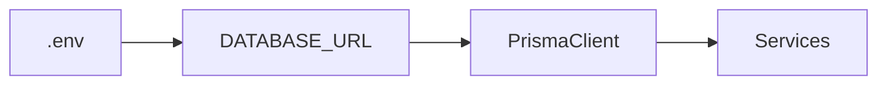

# Config

## Introducción

Configura la **conexión a la base de datos** y el **cliente Prisma** que consumen los servicios.

## Contenido

- **db.md**: descripción de la URL, pool y estrategia de conexión (PostgreSQL 16).
- **prismaClient.md**: generación y ciclo de vida del cliente Prisma.

## Diagrama

