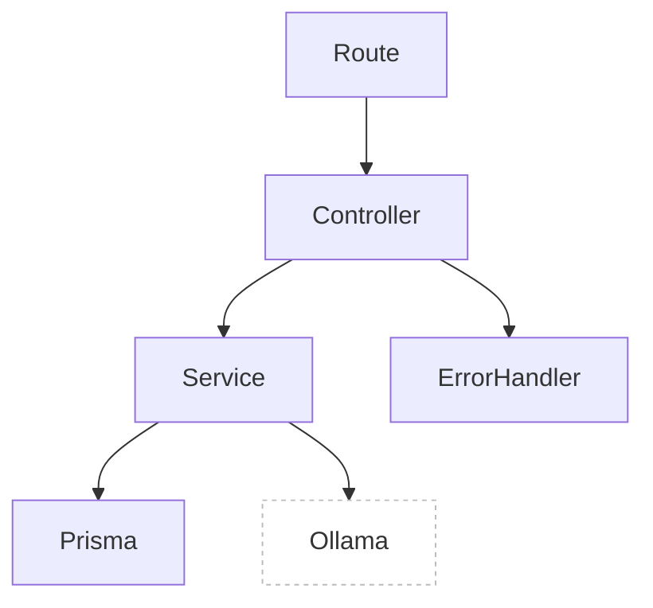

# Controllers

## Introducción

Traducen una request HTTP en acciones de negocio delegando a **services**, validan parámetros y formatean respuestas.

## Contenido

- **tasksController.md**: CRUD de tareas.
- **taskTagAssignmentsController.md**: N:M tareas ↔ etiquetas.
- **studySessionsController.md**: sesiones de estudio.
- **weeklyProductivityController.md**: vista materializada y refresh.
- **catalogsController.md**: catálogos (terms, statuses, priorities, types, tags).
- **batchImportController.md**: importación atómica por referencias.
- **llmControllorer.md**: recomendaciones y chat con LLM.

## Diagrama

