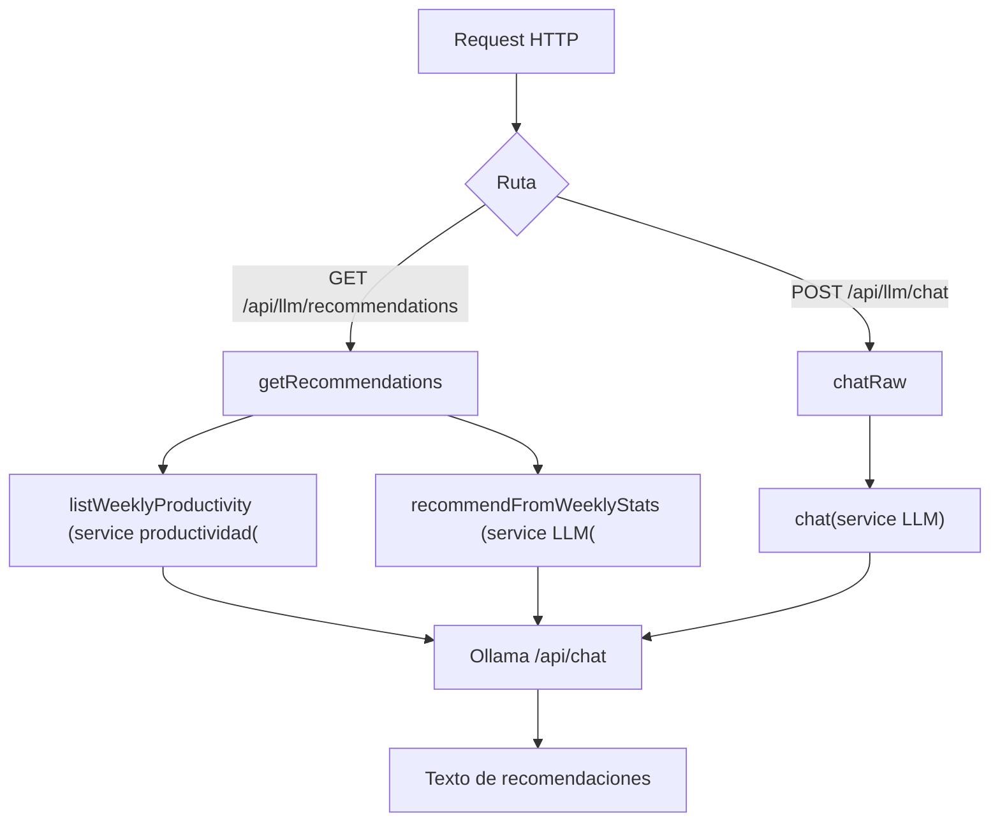

# Controller: llmController.js

## Introducción

Controlador HTTP para funcionalidades LLM. Orquesta la recuperación de métricas semanales desde el servicio de productividad y delega la generación de recomendaciones al servicio LLM.

## Funciones expuestas

- `getRecommendations(req, res, next)` → recibe `year`, `week`, `limitWeeks`; obtiene métricas vía servicio de productividad y solicita al LLM recomendaciones accionables. Responde `{ ok, model, inputWeeks, text, createdAt }`. Maneja `400` cuando no hay datos.
- `chatRaw(req, res, next)` → proxy controlado al LLM. Requiere `body.messages` con formato chat. Responde `{ ok, model, text }`. Maneja `400` cuando falta `messages`.

## Diagrama de flujo

## Validaciones clave

- Conversión segura de `year`, `week`, `limitWeeks` a enteros. Retorno 400 si no hay métricas.
- En `chatRaw`, `messages` debe ser un arreglo no vacío; de lo contrario 400.

## Formatos de respuesta

- Éxito: `res.json({ ok: true, model, text, ... })`.
- Error: se propaga a `errorHandler` con `next(err)`.

## Dependencias internas

- `#services/weeklyProductivityService.js` para métricas.
- `#services/llmService.js` para integración con Ollama.
