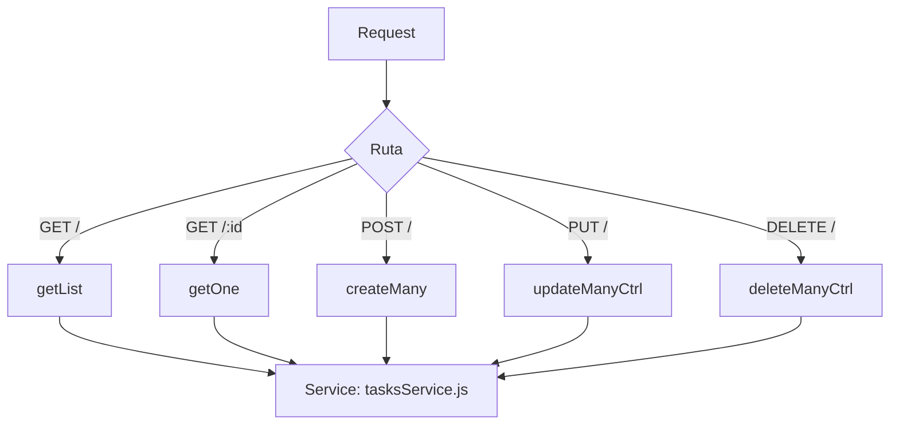

# Controller: tasksController.js

## Introducción

Controlador HTTP para la entidad principal **`tasks`** (tareas académicas).  
Gestiona el ciclo de vida completo de las tareas del sistema, incluyendo listados filtrados, obtención individual, creación masiva, actualización masiva y eliminación múltiple.  
Realiza validaciones básicas de entrada y delega la lógica de acceso a datos al servicio `tasksService.js`.

## Funciones expuestas

- `getList(req, res, next)` → lista tareas con filtros (`statusId`, `priorityId`, `typeId`, `termId`, `tagId`, `q`, `dueFrom`, `dueTo`, `archived`), paginación (`limit`, `offset`), orden (`orderByField`, `orderByDir`) e `include` (`lookups`, `tags`, `all`).
- `getOne(req, res, next)` → obtiene una tarea por su `taskId`; devuelve `404` si no existe.
- `createMany(req, res, next)` → crea una o varias tareas; valida body no vacío; responde `201 Created`.
- `updateManyCtrl(req, res, next)` → actualiza una o varias tareas existentes; requiere `taskId` por registro.
- `deleteManyCtrl(req, res, next)` → elimina una o varias tareas por `body.ids`; **rechaza** el uso de `?ids=`.

## Validaciones clave

- `POST`/`PUT`: body obligatorio; si vacío → `400 "Body vacío"`.
- `PUT`: cada objeto debe incluir `taskId`; de lo contrario → `400`.
- `DELETE`: requiere `{"ids":[...]}` en body; si llega en query → `400`.

## Manejo de errores

- `404`: tarea no encontrada.
- `409`: duplicado (`P2002`) o violación de FK (`P2003`).
- `400`: body inválido o sin `taskId`.

## Ejemplos

### Crear varias tareas

```json
POST /api/tasks
[
  {
    "title": "Lectura de capítulo 3",
    "description": "Apuntes resumidos",
    "taskStatusId": 1,
    "taskPriorityId": 2,
    "taskTypeId": 3,
    "termId": 1,
    "dueAt": "2026-01-15T00:00:00.000Z",
    "estimatedMin": 90
  },
  {
    "title": "Preparar presentación final",
    "description": "Revisar puntos clave del proyecto",
    "taskStatusId": 2,
    "taskPriorityId": 3,
    "taskTypeId": 2,
    "termId": 1,
    "dueAt": "2026-06-10T00:00:00.000Z",
    "estimatedMin": 240
  }
]
```

**Respuesta:** 201 Created

```json
{
  "count": 2,
  "items": [ { ... }, { ... } ]
}
```

## Diagrama de flujo



## Dependencias

- `#services/tasksService.js`
- `#config/prismaClient.js`
