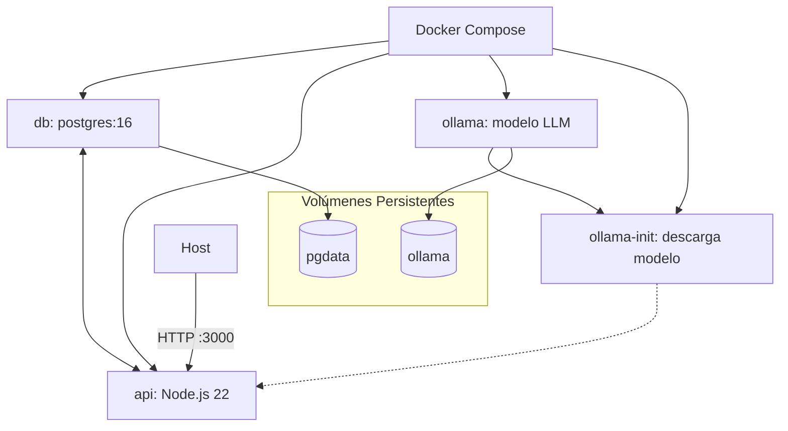

# Contenedorización del Backend

## Introducción

El archivo `docker.md` documenta la infraestructura de contenedores del backend de **Study Task Insights**, implementada con **Docker** y **Docker Compose**.
Define cómo se construyen, ejecutan y coordinan los servicios que componen la aplicación: API Node.js, base de datos PostgreSQL y el servicio de modelo de lenguaje (**Ollama**).

## Descripción general

El sistema está compuesto por tres servicios principales y un auxiliar:

1. **db** — Contenedor de **PostgreSQL 16** que almacena toda la información persistente de la aplicación.
   Se inicializa automáticamente con los scripts `.psql` ubicados en `server/migrations/`, ejecutados por `00_init.sh`.

2. **api** — Contenedor de **Node.js 22** que ejecuta el backend Express con Prisma ORM.
   Se conecta internamente a `db` y al servicio `ollama` para la generación de recomendaciones vía LLM.
   Expone la API en el puerto `3000`.

3. **ollama** — Servicio que ejecuta el motor **Ollama**, responsable de hospedar el modelo local de lenguaje (`qwen2.5:7b-instruct`).
   Se mantiene en segundo plano y es accesible solo desde la red interna de Docker.

4. **ollama-init** — Servicio auxiliar que se ejecuta una única vez al iniciar el entorno; descarga el modelo requerido y termina.
   Garantiza que el modelo esté disponible antes de que la API se inicie.

Los volúmenes persistentes `pgdata` y `ollama` aseguran la conservación de datos y modelos entre reinicios.

## Diagrama de flujo



**Flujo general:**

- `db` arranca y se inicializa con scripts SQL.
- `ollama` inicia y es verificado por un *healthcheck*.
- `ollama-init` descarga el modelo definido (`qwen2.5:7b-instruct`) en el volumen compartido.
- `api` espera a que ambos servicios estén listos antes de iniciar el servidor Express.

## Componentes documentados

### 1. `.dockerignore`

Define los archivos que se excluyen del contexto de construcción (por ejemplo: `node_modules`, `.env`, logs y archivos temporales).
Reduce el tamaño de las imágenes y mejora los tiempos de build.

### 2. `Dockerfile`

Construye la imagen base del backend (`api`) en cuatro etapas:

1. **base**: configura Node.js 22 y habilita `corepack`.
2. **deps**: instala dependencias con `pnpm` desde `package.json` y `pnpm-lock.yaml`.
3. **build**: ejecuta `prisma generate` para preparar el cliente ORM.
4. **runner**: copia el código fuente, dependencias y artefactos; expone el puerto `3000`.

El resultado es una imagen lista para producción, ligera y reproducible.

### 3. `docker-compose.yml`

Coordina los servicios que forman el backend completo:

#### **db**

- Imagen base `postgres:16`.
- Usa las variables del `.env` para usuario, contraseña y base de datos.
- Ejecuta los scripts SQL iniciales desde `./migrations/`.
- Healthcheck: espera a que la base responda correctamente antes de continuar.

#### **ollama**

- Imagen oficial `ollama/ollama:latest`.
- Mantiene los modelos descargados en un volumen persistente `ollama`.
- Healthcheck: verifica la disponibilidad de `ollama list`.
- No expone puertos al host (solo accesible internamente por el backend).

#### **ollama-init**

- Imagen igual a `ollama/ollama`.
- Se ejecuta una sola vez (`restart: no`).
- Descarga el modelo definido (`qwen2.5:7b-instruct`) antes de permitir el arranque de la API.
- Usa el mismo volumen `ollama` para compartir el modelo.

#### **api**

- Construida desde el `Dockerfile` del proyecto.
- Depende de `db` y `ollama-init`.
- Carga variables desde `.env` (por ejemplo, `DATABASE_URL`, `OLLAMA_URL`, `LLM_MODEL`).
- Expone el puerto `3000` al host.
- Se reinicia automáticamente (`restart: unless-stopped`).

#### **volúmenes**

- `pgdata` → almacenamiento persistente para la base de datos.
- `ollama` → almacenamiento de modelos LLM.

## Variables de entorno

Las configuraciones se leen desde el archivo `.env`, que debe generarse a partir de `.env.example`.
Incluyen parámetros para:

- Conexión a PostgreSQL
- Puerto y entorno del servidor Express
- Control de autenticación (`ACCESS_TOKEN`, `ACCESS_ENABLED`)
- Configuración del modelo LLM (`OLLAMA_URL`, `LLM_MODEL`, `LLM_TIMEOUT_MS`, `LLM_TEMPERATURE`)

## Ciclo de vida de uso

1. **Construcción y despliegue inicial**

   ```bash
   docker compose up -d --build
   ```

   Construye imágenes, levanta los servicios y descarga el modelo LLM si no existe.

2. **Verificación de estado**

   ```bash
   docker compose ps
   docker compose logs -f db
   docker compose logs -f ollama
   docker compose logs -f api
   ```

   Permite comprobar que los contenedores están activos y que el modelo fue descargado correctamente.

3. **Reinicio limpio**

   ```bash
   docker compose down -v
   docker compose up -d --build
   ```

   Elimina volúmenes (`pgdata`, `ollama`) y reinicia todo el entorno desde cero.

## Consideraciones técnicas

- `ollama` y `api` están en la misma red interna, permitiendo conexión por `http://ollama:11434`.
- `ollama-init` solo corre una vez y se detiene al finalizar la descarga del modelo.
- Los volúmenes garantizan persistencia tanto de datos (DB) como del modelo LLM.
- Todos los comandos deben ejecutarse desde el directorio `server/`.

## Dependencias internas

- `server/.dockerignore` — exclusiones de contexto.
- `server/Dockerfile` — imagen del backend Node.js.
- `server/docker-compose.yml` — orquestación completa (DB + API + LLM).
- `server/migrations/00_init.sh` — inicialización del esquema SQL.
