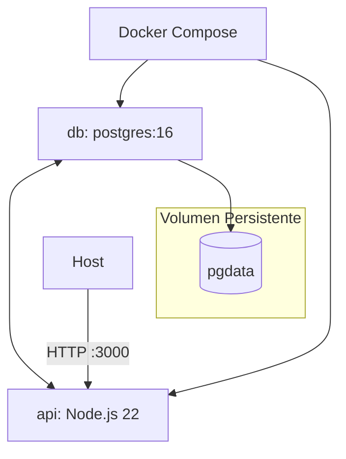

# docker.md — Contenedorización del Backend

## Introducción

El archivo `docker.md` documenta la infraestructura de contenedores del backend de **Study Task Insights**, implementada con **Docker** y **Docker Compose**.
Define cómo se construyen, ejecutan y coordinan los servicios del backend (API Node.js y base de datos PostgreSQL), junto con sus configuraciones, dependencias y procesos de inicialización.

## Descripción general

El sistema se compone de dos servicios principales:

1. **db** — Contenedor basado en la imagen oficial de PostgreSQL 16, responsable de almacenar los datos de la aplicación.
   Se inicializa automáticamente ejecutando los scripts `.psql` ubicados en `server/migrations/`, a través de un script auxiliar `00_init.sh`.

2. **api** — Contenedor que ejecuta la aplicación Node.js (Express + Prisma ORM).
   Utiliza `pnpm` como gestor de dependencias, se conecta internamente al contenedor `db`, y expone la API en el puerto `3000`.

El sistema usa un volumen persistente (`pgdata`) para la base de datos, evitando la pérdida de información entre reinicios.

## Diagrama de flujo



El flujo muestra cómo Docker Compose orquesta los servicios:

- El contenedor `api` depende de `db` y espera a que la base de datos esté lista.
- Los scripts de inicialización de SQL se ejecutan al crear el contenedor de la base.
- El volumen `pgdata` conserva el estado de los datos entre ejecuciones.

## Componentes documentados

### 1. `.dockerignore`

Define los archivos y carpetas que se excluyen del contexto de construcción de la imagen.
Evita copiar dependencias (`node_modules`), archivos de configuración locales (`.env`) y artefactos innecesarios que aumentan el tamaño de la imagen.

### 2. `Dockerfile`

Construye la imagen del servicio **api**.
Consta de cuatro etapas:

- **base**: configura el entorno Node 22, habilita `corepack` y define el directorio de trabajo.
- **deps**: instala las dependencias declaradas en `package.json` y `pnpm-lock.yaml`.
- **build**: ejecuta la generación de Prisma (`prisma generate`) para compilar el cliente ORM.
- **runner**: copia dependencias, código fuente y artefactos generados. Expone el puerto 3000 y ejecuta el servidor.

El resultado es una imagen optimizada para producción que encapsula todo el backend.

### 3. `docker-compose.yml`

Orquesta la ejecución de los contenedores **db** y **api**.
Define los siguientes comportamientos:

- Crea una red interna para la comunicación entre servicios.
- Usa variables de entorno definidas en `.env` para credenciales y configuración.
- Ejecuta automáticamente los scripts SQL (`*.psql`) al iniciar la base de datos.
- Realiza comprobaciones de salud (`healthcheck`) para asegurar que `db` esté lista antes de iniciar `api`.
- Expone los puertos 5432 (DB) y 3000 (API) hacia el host.

Incluye un volumen persistente (`pgdata`) para almacenar datos de la base de datos de forma segura.

### 4. `00_init.sh`

Script encargado de ejecutar en orden todos los archivos `.psql` contenidos en `/docker-entrypoint-initdb.d/` (montados desde `server/migrations/`).
Su propósito es inicializar la estructura del esquema, las tablas y los datos semilla.

El script:

- Se ejecuta automáticamente la primera vez que el contenedor `db` es creado.
- Detiene la ejecución ante cualquier error (`set -e`).
- Muestra en consola qué archivo se está ejecutando y confirma su finalización.
- Garantiza que la base quede lista antes de iniciar la API.

## Variables de entorno

Definidas en `server/.env`, controlan el comportamiento del sistema y la conexión entre servicios.
Incluyen parámetros de base de datos, puerto de la API, entorno de ejecución y configuración de integraciones externas.
La variable principal es `DATABASE_URL`, usada por Prisma para conectarse al contenedor `db`.

## Ciclo de vida de uso

1. **Construcción y arranque inicial**

   ```bash
   docker compose up -d --build
   ```

   Crea las imágenes, levanta los servicios y ejecuta el proceso de inicialización de la base de datos.

2. **Verificación**

   ```bash
   docker compose ps
   docker compose logs -f db
   docker compose logs -f api
   ```

   Permite comprobar que ambos servicios estén activos y operativos.

3. **Reinicio limpio (recrear DB y esquema)**

   ```bash
   docker compose down -v
   docker compose build --no-cache
   docker compose up -d
   ```

   Elimina el volumen persistente y fuerza la recreación de la base y las tablas desde los scripts.

## Consideraciones técnicas

- La inicialización de la base solo ocurre la **primera vez** o cuando el volumen `pgdata` es eliminado.
- El contenedor `api` depende del estado de salud (`healthy`) del servicio `db`.
- Todos los comandos de construcción y ejecución deben ejecutarse desde el directorio `server/`.
- Mmantener la misma estructura y volumen en entorno de despliegue.

## Dependencias internas

- `server/.dockerignore` — Configura exclusiones del contexto de build.
- `server/Dockerfile` — Define la imagen de la aplicación backend.
- `server/docker-compose.yml` — Orquesta base de datos y backend.
- `server/migrations/00_init.sh` — Automatiza la inicialización del esquema y carga inicial de datos.

Este documento cumple con el estándar organizacional:
estructura modular, explicación funcional, flujo técnico y dependencias claramente definidas.
