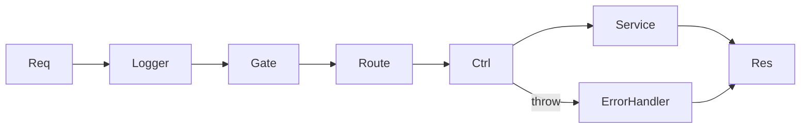

# Middlewares

## Introducción

Middlewares transversales aplicados a todas (o algunas) rutas.

## Contenido

- **accessGate.md**: protección por cookie `stia_session` (login/logout), usa `ACCESS_TOKEN`, `ACCESS_SESSION_HOURS`, `ACCESS_ENABLED`.
- **errorHandler.md**: captura y normaliza excepciones a JSON.
- **logger.md**: registro de inicio/fin de cada request con `requestId`, método, URL y duración.

## Diagrama

