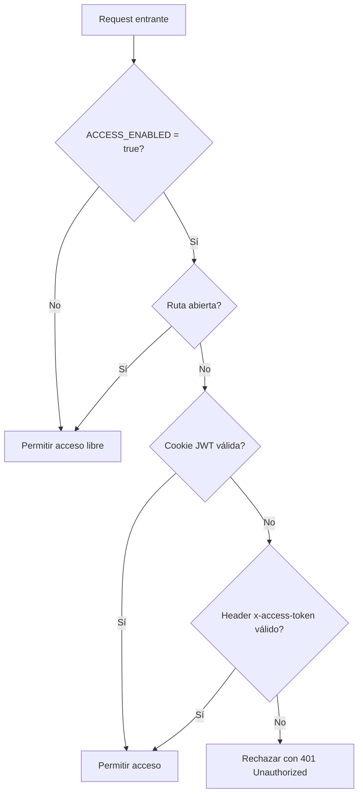

# Middleware: accessGate

## Introducción

El middleware `accessGate` controla el acceso a la API mediante validación de **token compartido** o **sesión JWT**.  
Permite habilitar o deshabilitar el control según la variable de entorno `ACCESS_ENABLED`.

## Descripción general

- Si `ACCESS_ENABLED` es `"false"`, permite acceso libre.  
- Si está activado, valida:
  - Cookie JWT (`stia_session`) firmada con `ACCESS_TOKEN`.  
  - O header `x-access-token` con el mismo valor del token compartido.
- Excluye rutas públicas `/healthz`, `/gate/login` y `/gate/logout`.

## Diagrama de flujo



## Ejemplo de uso

Se aplica globalmente en `app.js`:

```js
import { accessGate } from "#middlewares/accessGate.js";
app.use(accessGate);
```

## Variables de entorno requeridas

| Variable         | Descripción                            | Ejemplo            |
| ---------------- | -------------------------------------- | ------------------ |
| `ACCESS_ENABLED` | Habilita control de acceso             | `"true"`           |
| `ACCESS_TOKEN`   | Token secreto compartido               | `"supersecret123"` |
| `NODE_ENV`       | Determina modo producción o desarrollo | `"development"`    |

## Dependencias internas

- `jsonwebtoken`
- `logger` (para registrar eventos de acceso)
