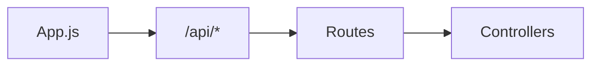

# Routes

## Introducción

Define la **interfaz HTTP pública** del backend: paths, métodos y montaje en `app.js`.

## Contenido

* **tasksRoutes.md**: `/api/tasks`
* **taskTagAssignmentsRoutes.md**: `/api/task-tag-assignments`
* **studySessionsRoutes.md**: `/api/study-sessions`
* **weeklyProductivityRoutes.md**: `/api/weekly-productivity`
* **catalogsRoutes.md**: `/api/catalogs/*`
* **batchImportRoutes.md**: `/api/import/batch`
* **llmRoutes.md**: `/api/llm`

## Diagrama

## Convenciones

* Prefijo único `/api/…` y nouns en plural.
* Rutas protegidas por **accessGate** (montado en `app.js`).
