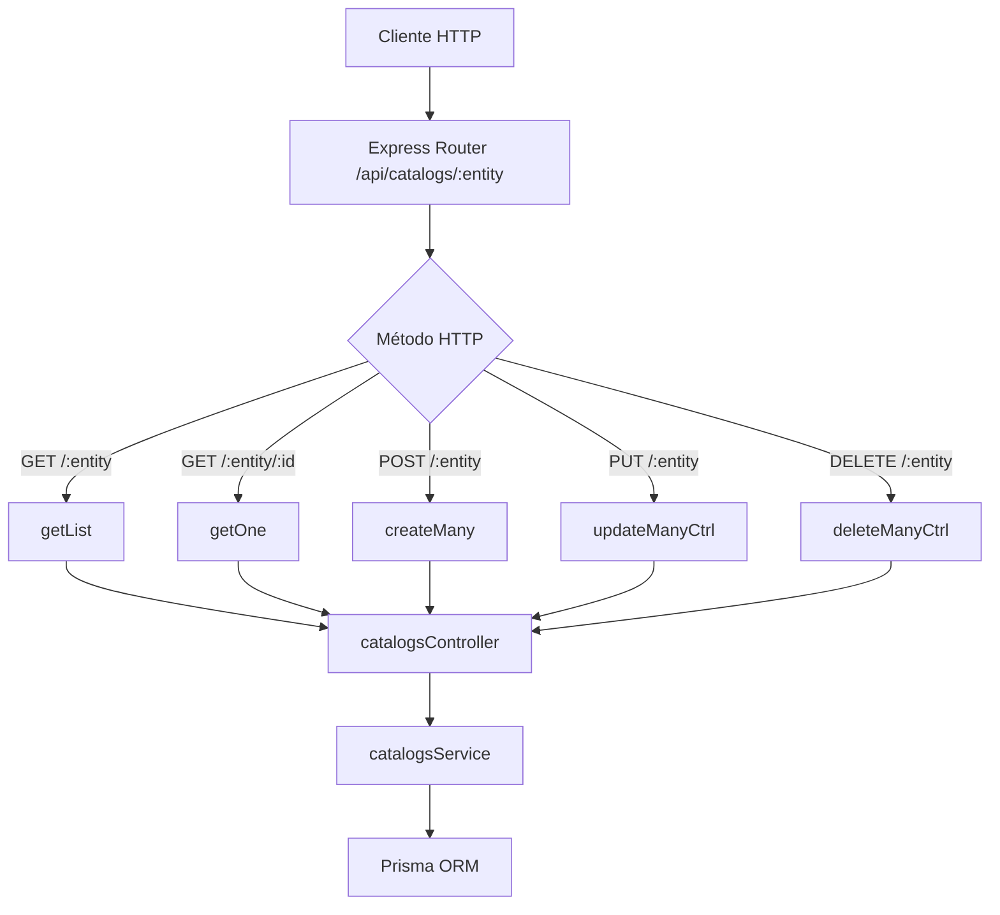

# Rutas: Catálogos (`catalogsRoutes.js`)

## Introducción

El módulo `catalogsRoutes.js` define los endpoints REST para el manejo genérico de **catálogos base** del sistema Study Task Insights.  
Cada ruta está asociada a un tipo de catálogo gestionado por `catalogsController.js` y su respectivo servicio Prisma.

## Descripción general

Los catálogos representan entidades maestras que clasifican tareas y métricas académicas:  

- `terms` → períodos académicos  
- `task-statuses` → estados de tareas  
- `task-priorities` → prioridades  
- `task-types` → tipos de tarea  
- `task-tags` → etiquetas globales  

Cada catálogo comparte la misma estructura CRUD para mantener uniformidad y escalabilidad.

## Diagrama de flujo



## Endpoints definidos

| Método   | Ruta                        | Descripción                                                        | Controlador      |
| -------- | --------------------------- | ------------------------------------------------------------------ | ---------------- |
| `GET`    | `/api/catalogs/:entity`     | Lista registros del catálogo con soporte de búsqueda y paginación. | `getList`        |
| `GET`    | `/api/catalogs/:entity/:id` | Obtiene un registro específico por ID.                             | `getOne`         |
| `POST`   | `/api/catalogs/:entity`     | Crea uno o varios registros nuevos.                                | `createMany`     |
| `PUT`    | `/api/catalogs/:entity`     | Actualiza uno o varios registros existentes.                       | `updateManyCtrl` |
| `DELETE` | `/api/catalogs/:entity`     | Elimina varios registros según IDs en el cuerpo.                   | `deleteManyCtrl` |

## Ejemplo de uso (API)

### Listar catálogos de tipos de tarea

```bash
GET /api/catalogs/task-types
```

**Respuesta:**

```json
{
  "items": [
    { "taskTypeId": 1, "code": "exam", "description": "Examen" },
    { "taskTypeId": 2, "code": "project", "description": "Proyecto final" }
  ],
  "total": 2
}
```

### Crear nuevas etiquetas

```bash
POST /api/catalogs/task-tags
Content-Type: application/json

[
  { "name": "lectura", "color": "#4A90E2" },
  { "name": "proyecto-2", "color": "#F5A623" }
]
```

**Respuesta:**

```json
{
  "count": 2,
  "items": [
    { "taskTagId": "a9b7...", "name": "lectura" },
    { "taskTagId": "b5de...", "name": "proyecto-2" }
  ]
}
```

## Reglas y convenciones

- `:entity` debe coincidir con una clave válida definida en `catalogsService.js` (`ENTITY_MAP`).
- Los cuerpos deben ser JSON válidos; las operaciones masivas aceptan arreglos.
- `DELETE` requiere body: `{ "ids": [...] }` (no se usa query `?ids=`).
- Errores controlados incluyen `400` (input inválido), `404` (no encontrado), `409` (duplicado) y `500` (error interno).

## Dependencias internas

- `express.Router`
- `catalogsController.js`
- `catalogsService.js` (vía los controladores)
