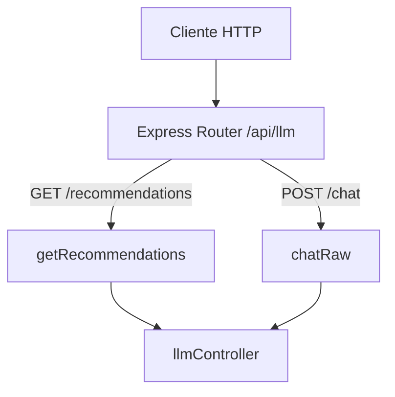

# Rutas: LLM (`llmRoutes.js`)

## Introducción

Define los endpoints REST relacionados con el LLM: recomendaciones basadas en datos internos y chat controlado. Las rutas quedan protegidas por el `accessGate` global definido en `app.js`.

## Descripción general

- `GET /api/llm/recommendations` → genera recomendaciones a partir de métricas semanales.
- `POST /api/llm/chat` → canal de chat genérico con el modelo (para usos controlados).

## Diagrama de flujo

## Endpoints definidos

| Método | Ruta                       | Descripción                                          | Controlador          |   |
| -----: | -------------------------- | ---------------------------------------------------- | -------------------- | - |
|  `GET` | `/api/llm/recommendations` | Recomendaciones por semana/año con datos reales.     | `getRecommendations` |   |
| `POST` | `/api/llm/chat`            | Chat libre controlado (formato `messages` tipo chat) | `chatRaw`            |   |

## Reglas y convenciones

- Requiere autenticación/gate global previa al montaje de rutas.
- `POST /chat` exige `Content-Type: application/json` y `messages` válido.

## Dependencias internas

- `express.Router`
- `llmController.js` (controladores específicos)
