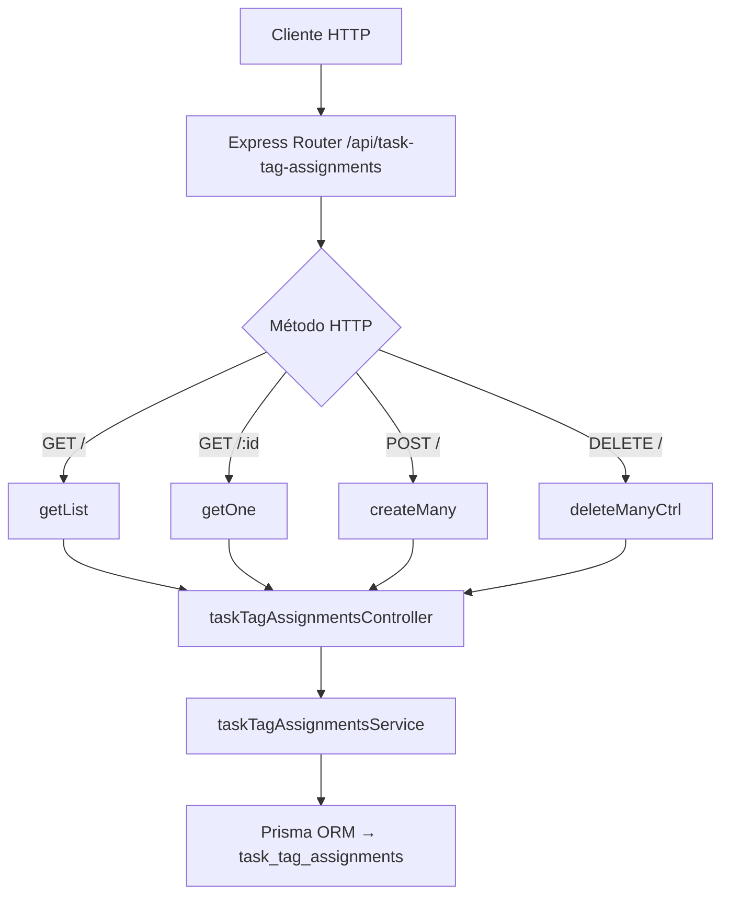

# Rutas: Task–Tag Assignments (`taskTagAssignmentsRoutes.js`)

## Introducción

Define los endpoints REST para la entidad relacional **`task_tag_assignments`**, que enlaza tareas (`tasks`) con etiquetas (`task_tags`).  
Sigue la convención REST estándar del backend de Study Task Insights, con operaciones controladas por `taskTagAssignmentsController.js`.

## Endpoints definidos

| Método | Ruta                              | Descripción                                               | Controlador      |
|-------:|-----------------------------------|-----------------------------------------------------------|------------------|
| `GET`  | `/api/task-tag-assignments`       | Lista las asignaciones con filtros, paginación y includes | `getList`        |
| `GET`  | `/api/task-tag-assignments/:id`   | Obtiene una asignación específica                         | `getOne`         |
| `POST` | `/api/task-tag-assignments`       | Crea una o varias asignaciones nuevas                     | `createMany`     |
| `DELETE` | `/api/task-tag-assignments`     | Elimina varias asignaciones por `body.ids`                | `deleteManyCtrl` |

## Parámetros de consulta

- **Filtros:** `taskId`, `tagId`
- **Paginación:** `limit` (1–200), `offset` (≥0)
- **Orden:** `orderByField`, `orderByDir` (`asc|desc`)
- **Include:**  
  - `task` → incluye datos básicos de la tarea  
  - `tag` → incluye información de la etiqueta  
  - `all` → incluye ambos  

## Ejemplos

### Listar asignaciones de una tarea

```bash
GET /api/task-tag-assignments?taskId=uuid-task1&include=tag
```

**Respuesta:**

```json
{
  "items": [
    { "taskTagAssignmentId": "uuid1", "taskId": "uuid-task1", "taskTagId": "uuid-tagA", "tag": { "name": "Lectura" } }
  ],
  "total": 1
}
```

### Eliminar relaciones

```bash
DELETE /api/task-tag-assignments
{ "ids": ["uuid1", "uuid2"] }
```

**Respuesta:** 200 OK

```json
{
  "count": 2,
  "deletedIds": ["uuid1","uuid2"],
  "notFoundIds": []
}
```

## Diagrama



## Reglas y convenciones

- No se permite `?ids=` en query (`400`).
- Los cuerpos deben ser JSON válidos; operaciones masivas aceptan arreglos.
- Errores:

  - `400`: body inválido
  - `404`: no encontrado
  - `409`: duplicado o FK inválido
  - `500`: error interno
