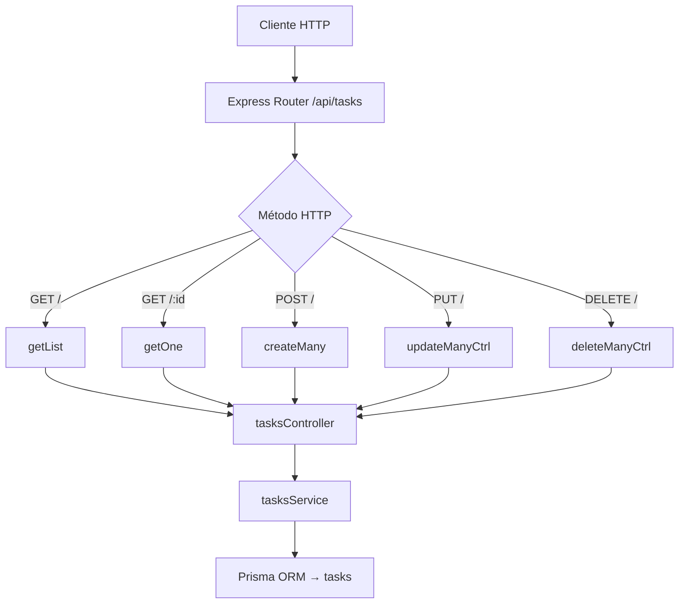

# Rutas: Tasks (`tasksRoutes.js`)

## Introducción

Define los endpoints REST para la entidad **`tasks`**, núcleo del sistema Study Task Insights.  
Cada ruta está asociada a su controlador (`tasksController.js`) y se registra bajo `/api/tasks`.

## Endpoints definidos

| Método   | Ruta              | Descripción                                                  | Controlador      |
| -------- | ----------------- | ------------------------------------------------------------ | ---------------- |
| `GET`    | `/api/tasks`      | Lista tareas filtradas y paginadas.                         | `getList`        |
| `GET`    | `/api/tasks/:id`  | Obtiene una tarea específica por ID.                         | `getOne`         |
| `POST`   | `/api/tasks`      | Crea una o varias tareas nuevas.                            | `createMany`     |
| `PUT`    | `/api/tasks`      | Actualiza una o varias tareas existentes.                    | `updateManyCtrl` |
| `DELETE` | `/api/tasks`      | Elimina varias tareas según `body.ids`.                      | `deleteManyCtrl` |

## Parámetros de consulta (GET /api/tasks)

- **Filtros:**  
  `statusId`, `priorityId`, `typeId`, `termId`, `tagId`, `q`, `dueFrom`, `dueTo`, `archived` (`true|false`)
- **Proyección:**  
  `include=lookups|tags|all`
- **Orden:**  
  `orderByField`, `orderByDir` (`asc|desc`)
- **Paginación:**  
  `limit` (1–200), `offset` (≥0)

## Ejemplos

### Listar tareas con etiquetas incluidas

```bash
GET /api/tasks?include=all&limit=10
```

### Eliminar tareas por IDs

```bash
DELETE /api/tasks
{ "ids": ["uuid1", "uuid2"] }
```

## Errores esperados

- `400`: body inválido o parámetros incorrectos.
- `404`: tarea no encontrada.
- `409`: duplicado (índice único parcial) o FK inválido.

## Diagrama de flujo



## Dependencias internas

- `express.Router`
- `tasksController.js`
- `tasksService.js`
