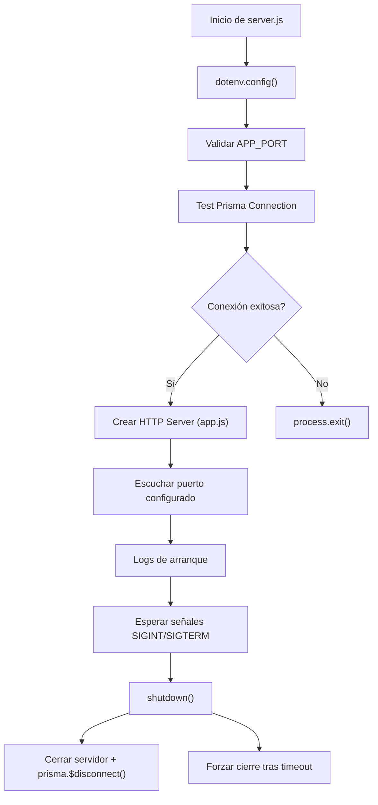

# Servidor HTTP

## Introducción

El archivo `server.js` se encarga del **arranque, monitoreo y apagado controlado** del servidor Express.
Integra la carga de variables de entorno (`dotenv`), conexión a base de datos con **Prisma ORM**, y manejo de señales del sistema.

## Funcionalidad general

1. **Carga de entorno:**

   - Verifica la existencia y validez de `APP_PORT`.
   - Aborta el arranque si falta o es inválido.

2. **Prueba de conexión inicial:**

   - Ejecuta una consulta `SELECT NOW()` vía Prisma para validar conexión a PostgreSQL.
   - Si falla, detiene el proceso (`process.exit(1)`).

3. **Inicio del servidor HTTP:**

   - Crea instancia `http.Server` y escucha en el puerto configurado.
   - Muestra mensajes de log con fecha y estado de conexión.

4. **Apagado controlado:**

   - Maneja señales `SIGINT` y `SIGTERM`.
   - Cierra el servidor y desconecta Prisma con tiempos de espera controlados.
   - Incluye mecanismo de “forzado” si el cierre excede 5 segundos.

5. **Gestión de errores globales:**

   - Registra `unhandledRejection` y `uncaughtException` para evitar cierres abruptos.
   - Muestra logs en consola detallados del error capturado.

## Diagrama de flujo

## Validaciones y seguridad

- Se asegura que el puerto sea numérico antes de iniciar.
- El apagado usa bandera `isShuttingDown` para evitar múltiples ejecuciones simultáneas.
- Prisma se desconecta limpiamente incluso en cierres forzados.

## Dependencias internas

- `app.js` — aplicación Express principal.
- `#config/prismaClient.js` — cliente Prisma ORM conectado a PostgreSQL.
- `dotenv` — carga de variables desde `.env`.
