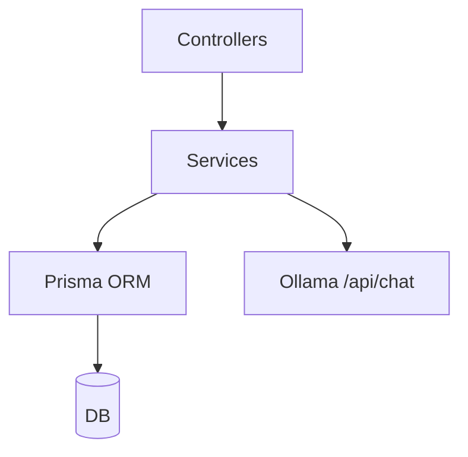

# Services

## Introducción

Capa de **lógica de negocio** y acceso a datos. Consumida por controladores. Aísla Prisma y otras integraciones (LLM).

## Contenido

* **tasksService.md**: CRUD y queries de tareas; índices por estado, prioridad, término.
* **taskTagAssignmentsService.md**: asignaciones N:M con unicidad y FK.
* **studySessionsService.md**: creación/consulta de sesiones; validación temporal.
* **weeklyProductivityService.md**: lectura/refresh de la materializada; agregaciones.
* **catalogsService.md**: CRUD genérico de catálogos con `ENTITY_MAP`.
* **batchImportService.md**: orquesta creación masiva (resuelve refs → UUID).
* **lllmService.md**: integración HTTP con Ollama (chat y recomendaciones).

## Diagrama

