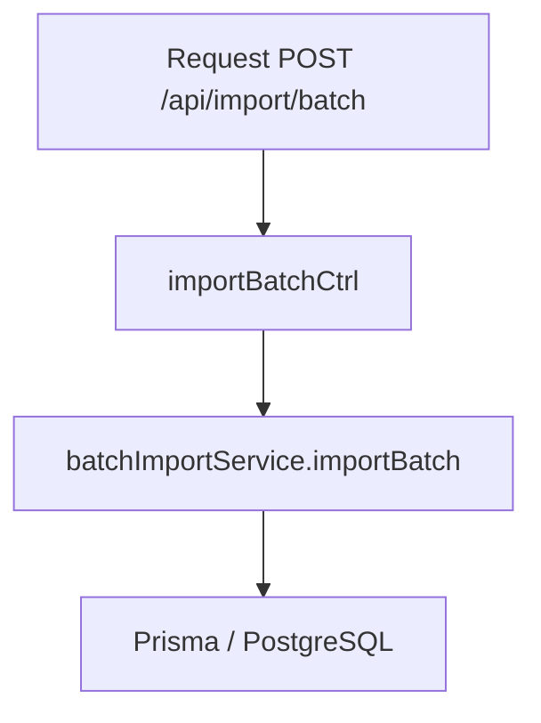

# Controller: batchImportController.js

## Introducción

Controlador HTTP para la importación por lotes. Delegación directa al servicio y manejo de errores centralizado.

## Funciones expuestas

- `importBatchCtrl(req, res, next)` → ejecuta la importación y devuelve `taskIdMap`.

## Diagrama de flujo

## Formatos de respuesta

- Éxito: `{ ok: true, created: {…}, taskIdMap: {…} }`
- Error: `next(err)` → manejado por `errorHandler`.
