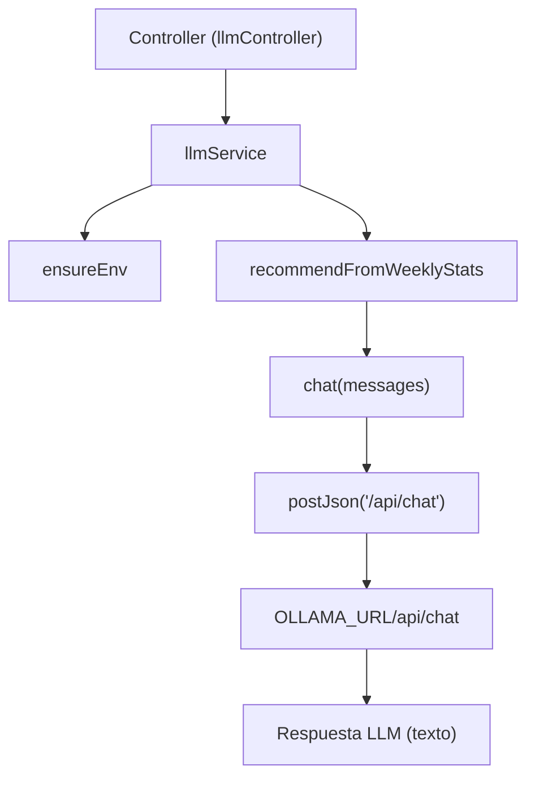

# Service: llmService.js

## Introducción

Servicio de integración con **Ollama**. Encapsula la llamada HTTP al endpoint `/api/chat`, maneja timeout, valida variables de entorno y construye prompts de negocio para recomendaciones semanales.

## Descripción general

- Valida `OLLAMA_URL`, `LLM_MODEL`, `LLM_TIMEOUT_MS`, `LLM_TEMPERATURE` al cargar el módulo; si falta alguna, lanza error con `statusCode=500`.
- Expone `chat(messages)` para interacción directa con el modelo.
- Expone `recommendFromWeeklyStats({ weeklyStats, summary })` que crea mensajes `system`/`user` con JSON compacto de métricas y solicita al modelo recomendaciones accionables.

## Diagrama de flujo

## Funciones exportadas

- `chat(messages)`
  Envía `{ model, messages, stream:false, options:{ temperature } }` a Ollama y retorna el texto (`message.content` o `response`). Maneja errores HTTP como `503` y timeout como `504`.

- `recommendFromWeeklyStats({ weeklyStats, summary })`
  Compacta campos relevantes (`year, week, created, completed, completionRate, plannedMin, actualMin`), arma `system` y `user` en español y delega en `chat`. Retorna recomendaciones en texto.

## Validaciones y manejo de errores

- `ensureEnv()` verifica presencia y tipo de variables de entorno al inicio.
- `postJson()` implementa `AbortController` con timeout configurable; en abort lanza `504`; en HTTP no-OK lanza `503` con texto del backend LLM.

## Dependencias internas

- Variables de entorno (`process.env`) definidas en `.env`.
- `fetch` nativo de Node 22 para llamadas HTTP a Ollama.
- No usa Hugging Face ni tokens externos.
