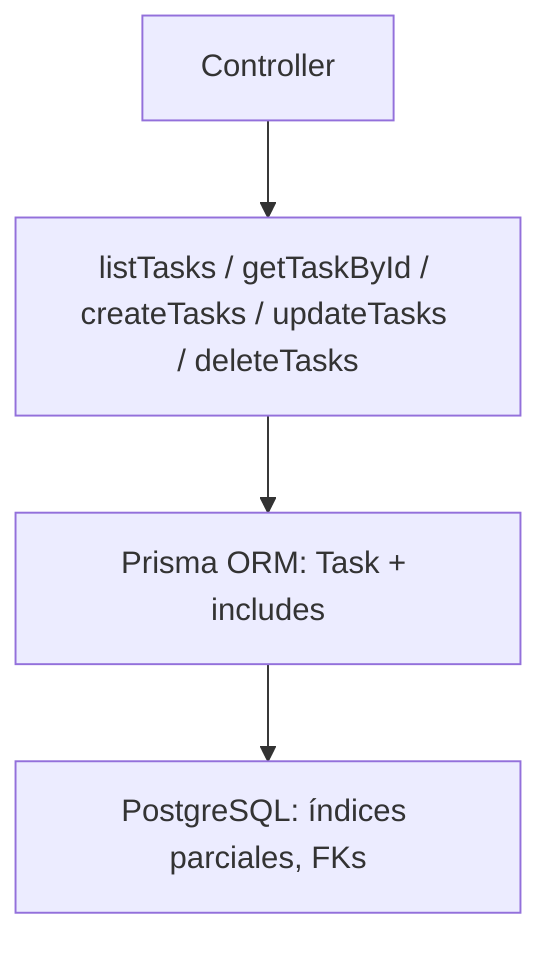

# Service: tasksService.js

## Introducción

Implementa la lógica de acceso a datos para **tasks** usando Prisma. Aplica filtros, paginación, relaciones opcionales, manejo de errores y respeta las restricciones únicas parciales definidas en la base de datos.

## API del servicio

### `listTasks(params)`

**Entrada:**  
`q, limit, offset, statusId, priorityId, typeId, termId, tagId, dueFrom, dueTo, archived, include, orderBy`  
**Comportamiento:**  

- Construye `where` dinámico:
  - igualdad (`statusId`, `priorityId`, `typeId`, `termId`),
  - N:M por etiqueta (`tagId` → `taskTagAssignments.some`),
  - rango (`dueFrom`, `dueTo`),
  - texto (`q` en `title`/`description`, case-insensitive),
  - visibilidad (`archived`: por defecto solo activas).
- `include`: `lookups`, `tags`, `all`.  
- `orderBy` por `dueAt` asc (default) o el solicitado.  
- Paginación segura (`limit`≤200).

**Salida:**  

```json
{ "items": [...], "total": 123 }
```

### `getTaskById(taskId, { include })`

Obtiene una tarea por UUID con relaciones opcionales (`lookups`, `tags`, `all`).
Si no existe → **404**.

### `createTasks(payload)`

Crea 1..n tareas (objeto o arreglo).

- Limpia campos de solo lectura (`taskId`, `createdAt`, `updatedAt`).
- Ejecuta creates en transacción.
- Errores:

  - **`P2003`**: violación de FK → **409**.
  - **`P2002`**: conflicto de unicidad (índices parciales de tareas activas) → **409** con mensaje claro.

**Respuesta:**

```json
{ "count": n, "items": [ ... ] }
```

### `updateTasks(payload)`

Actualiza 1..n tareas. Requiere `taskId` en cada objeto.

- Limpia campos de solo lectura; no permite cambiar `taskId`.
- Respuesta incluye listas de conflicto/no encontrado:

```json
{
  "count": n,
  "items": [ ... ],
  "notFoundIds": ["..."],
  "conflictIds": [{ "id":"...", "message":"...", "target":[...] }]
}
```

- Errores:

  - **`P2025`**: no encontrada (se acumula en `notFoundIds`).
  - **`P2002`**: conflicto de unicidad (activa duplicada).
  - **`P2003`**: violación de FK.

### `deleteTasks(ids)`

Elimina 1..n por `taskId`.

- Clasifica en `deletedIds`, `notFoundIds` y `blockedIds` (FK).
  **Respuesta:**

```json
{
  "count": n,
  "deletedIds": ["..."],
  "notFoundIds": ["..."],
  "blockedIds": ["..."]
}
```

## Includes soportados

- `lookups`: `taskStatus`, `taskPriority`, `taskType`, `term`
- `tags`: `taskTagAssignments` + `taskTag`
- `all`: lookups + tags

## Consideraciones de unicidad (DB)

La unicidad se garantiza con **índices únicos parciales**:

- `(term_id, lower(btrim(title)), due_at)` cuando la tarea está **activa** y `due_at` **no es nulo**.
- `(term_id, lower(btrim(title)))` cuando la tarea está **activa** y `due_at` **es nulo**.

El servicio traduce `P2002` → `409` con un mensaje explícito para el cliente.

## Diagrama


